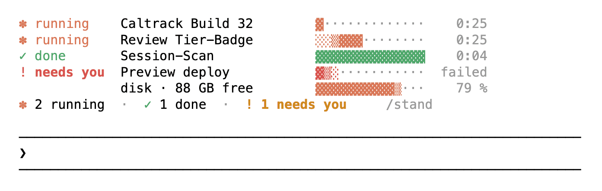
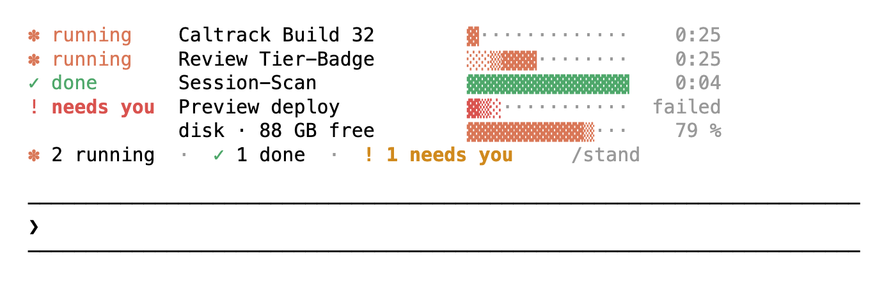
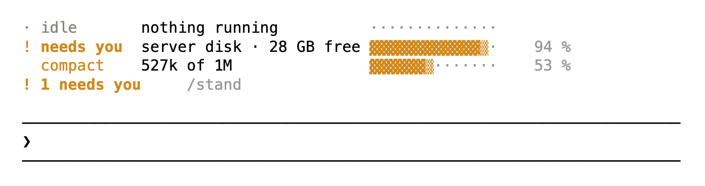
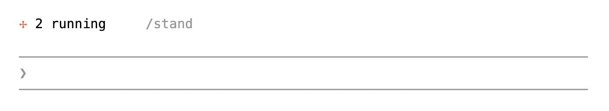
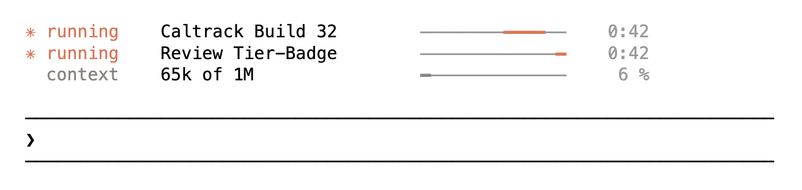

# Leitstand

*German for control room. Say "LITE-shtand".*

<picture>
  <source media="(prefers-color-scheme: dark)" srcset="docs/loud-dark.gif">
  
</picture>

Leitstand is a mod for Claude Code. It puts a small control room above your prompt, so you see at a glance what Claude is doing in the background. You also see what finished, what failed, how much disk is left and when the context gets full.

## Install

```sh
claude plugin marketplace add dominikmartn/leitstand
claude plugin install leitstand@leitstand
```

Then start a new session. The list appears as soon as Claude starts a background agent or shell.

Leitstand needs Claude Code with mods (TypeScript plugin hooks). I tested it with Claude Code 2.1.288 on macOS.

## What you see

Every row has the same columns: state, name, bar, time.

<picture>
  <source media="(prefers-color-scheme: dark)" srcset="docs/loud-open-dark.png">
  
</picture>

- **running**: a background agent or shell. The bar moves while it runs, and the time counts up.
- **done**: the job finished. It stays until your next prompt, so you do not miss it.
- **needs you**: a job failed, or the disk is running low. The footer counts these in yellow.
- **disk**: free space on this machine. It warns at 35 GB free and turns red at 20 GB.
- **compact**: from 250k tokens on, this row shows how full the context is.

Type `/stand` to fold the list into one line. Folding counts as "seen": finished jobs leave, and the disk warning stays quiet until it gets worse.

<picture>
  <source media="(prefers-color-scheme: dark)" srcset="docs/loud-warn-dark.png">
  
</picture>

When a hook of yours blocks a tool call, Leitstand shows the hook's name and its reason until your next prompt.

## Two themes

**loud** is the default. The list stays open while anything runs, with halftone bars.

**quiet** shows one line while jobs run. Finished work disappears right away, because Claude tells you about it in the chat anyway. The disk shows only when it runs low.

<picture>
  <source media="(prefers-color-scheme: dark)" srcset="docs/quiet-folded-dark.png">
  
</picture>

<picture>
  <source media="(prefers-color-scheme: dark)" srcset="docs/quiet-open-dark.png">
  
</picture>

To switch, set the variable before you start Claude Code:

```sh
export LEITSTAND_THEME=quiet
```

## Settings

| Variable | Default | What it does |
| --- | --- | --- |
| `LEITSTAND_THEME` | `loud` | `loud` or `quiet` |
| `LEITSTAND_DISK_HOST` | unset | Measures the disk of an ssh host instead of this machine, for example a build server |
| `LEITSTAND_SOUND` | on | `off` mutes the sound after long work |

The sound plays on macOS when work took longer than a minute and nothing runs any more. On Linux it stays silent.

The disk host goes to `ssh -o BatchMode=yes`, so it needs key-based login. Leitstand accepts only plain host names. Anything else shows `invalid disk host`, and Leitstand does not fall back to the local disk. When a measurement fails, the last value stays with `stale` next to it.

## For agents

If a user asks you to install, configure or debug Leitstand, these facts apply.

- Type: Claude Code plugin with a hooks module, `hooks/register.tsx`, listed in `hooks/hooks.json`. No MCP server, no skills. The only network call is ssh, and only when `LEITSTAND_DISK_HOST` is set.
- Install: `claude plugin marketplace add dominikmartn/leitstand`, then `claude plugin install leitstand@leitstand`. Add `--scope project` to both for one project only. The user must start a new session.
- Configure: only the three environment variables above. They are read when the list renders, so the user sets them in the shell or in the `env` block of `settings.json`.
- Tracked work: `Agent` tool calls and `Bash` calls with `run_in_background: true` from the main session. Subagents' own tool calls are not tracked. A job ends when Claude Code delivers a task notification for its id.
- Commands it runs: `sh -c 'df -kP /System/Volumes/Data 2>/dev/null || df -kP /'` every 5 minutes, or the same `df` through `ssh` when `LEITSTAND_DISK_HOST` is set. On macOS, `afplay /System/Library/Sounds/Glass.aiff`.
- State: the disk value is shared between sessions through the plugin store. All other state lives in the session.
- Check that it loaded: `claude plugin list` shows `leitstand@leitstand`. Typing `/stand` in a session opens the list.
- Tests: `claude plugin test .` in the repo.

## Develop

```sh
git clone https://github.com/dominikmartn/leitstand
cd leitstand
CLAUDE_CODE_PLUGIN_DIRS=$PWD claude
claude plugin test .
```

The editor types live in `.claude-plugin/types/`. Claude Code's plugin tooling generates them, and they are not committed.

## Why German

I built this for myself first and called it Leitstand, the word for the room where people watch a power plant or a rail network. It stayed. English has kindergarten and zeitgeist, so it can take one more.

Made by [@dominikmartn](https://x.com/dominikmartn) · MIT license
